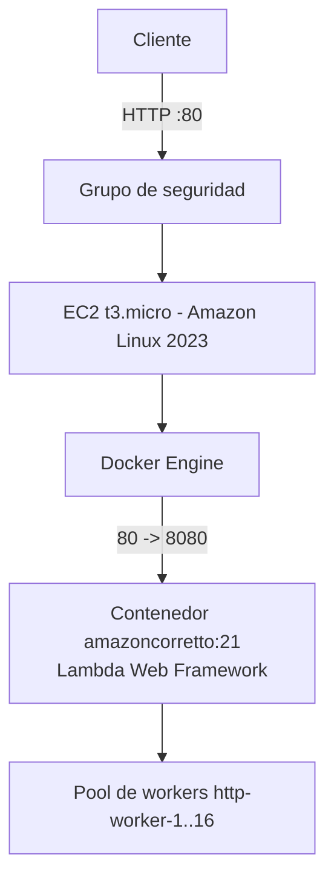
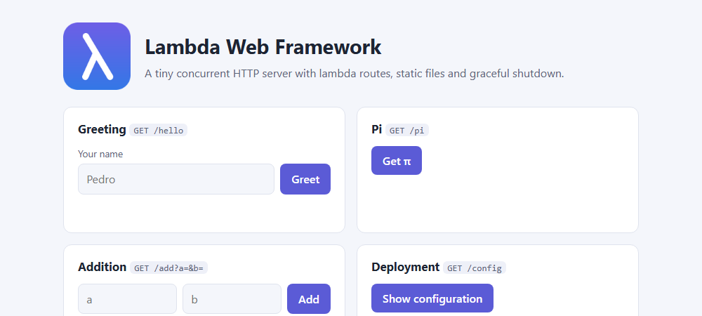
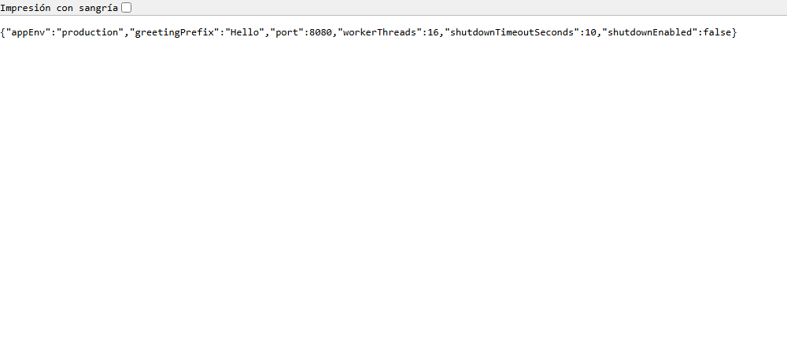

# Lambda Web Framework: extensión para contenedores y nube

Extensión del **framework web propio del curso** (sin Spring) para cumplir el **Repositorio 2: Framework extension** del taller *Containerizing and Deploying a Java Web Application*. El framework sirve rutas `GET` definidas con lambdas y archivos estáticos usando solo el JDK (`ServerSocket`), y ahora además:

- atiende **solicitudes concurrentes** con un pool de hilos,
- hace **apagado controlado (graceful shutdown)**,
- lee su **puerto y demás configuración de variables de entorno**,
- corre en un **contenedor Docker** basado en Amazon Corretto 21,
- está **desplegado en una instancia AWS EC2**.

| Recurso | Enlace |
|---|---|
| Video de demostración (despliegue local con Docker y en EC2) | [youtu.be/rlmp5gFdka4](https://youtu.be/rlmp5gFdka4) |
| Imagen en Docker Hub | [hub.docker.com/r/carlosavellaneda1/webframework](https://hub.docker.com/r/carlosavellaneda1/webframework) |
| Despliegue público (EC2) | [http://54.91.111.81/](http://54.91.111.81/) |
| Repositorio 1 (workshop con Spring Boot) | [Workshop-implementation](https://github.com/Carlos-Avellaneda-2/Containerizing-and-Deploying-a-Java-Web-Application-Workshop-implementation) |

## Contenido

- [Estado del framework](#estado-del-framework)
- [Cambios de la extensión](#cambios-de-la-extensión)
- [Configuración](#configuración)
- [Compilar y ejecutar](#compilar-y-ejecutar)
- [Ejecutar en Docker](#ejecutar-en-docker)
- [Despliegue en AWS EC2](#despliegue-en-aws-ec2)
- [Evidencia de progreso](#evidencia-de-progreso)
- [Evidencias](#evidencias)

## Estado del framework

| Componente | Responsabilidad |
|---|---|
| `WebFramework` | API pública estática: `get()`, `staticfiles()`, `start()`, `stop()`, `configure()`, `stopOnJvmShutdown()` |
| `HttpServer` | Acepta conexiones TCP, las reparte al pool de workers, parsea HTTP/1.1, despacha y escribe la respuesta |
| `Router` | Tabla `método + ruta -> RouteHandler` (thread-safe, `ConcurrentHashMap`) |
| `Request` / `Response` | Petición parseada (query string decodificado en UTF-8) y respuesta con estado, cabeceras y cuerpo |
| `StaticFileService` | Sirve archivos desde el classpath (`/webroot`) o desde una carpeta (`STATIC_FILES_PATH`), bloqueando *path traversal* |
| `Config` | Vista de solo lectura de las variables de entorno, con validación y valores por defecto |
| `app.Application` | Aplicación de ejemplo: `/hello`, `/pi`, `/add`, `/config`, `/slow`, `/status` y `/shutdown` (solo en desarrollo) |

Ejemplo de uso del framework:

```java
import static co.edu.escuelaing.webframework.WebFramework.*;

public static void main(String[] args) throws Exception {
    staticfiles("/webroot");
    get("/hello", (req, resp) -> "Hello " + req.getValue("name"));
    stopOnJvmShutdown();   // SIGTERM -> apagado controlado
    start();               // PORT, WORKER_THREADS, SHUTDOWN_TIMEOUT_SECONDS desde el entorno
}
```

El framework no tiene dependencias en tiempo de ejecución (solo JDK 21); JUnit 5 se usa únicamente para pruebas.

## Cambios de la extensión

### 1. Manejo concurrente de solicitudes

Antes el servidor era **estrictamente secuencial**: aceptaba una conexión, la atendía completa y solo entonces aceptaba la siguiente, así que una petición lenta bloqueaba a todos los clientes.

Ahora el hilo principal solo ejecuta el ciclo `accept()` y entrega cada `Socket` a un **pool fijo de hilos** (`Executors.newFixedThreadPool`, hilos `http-worker-N`). El tamaño se controla con `WORKER_THREADS` (16 por defecto). El pool acotado evita crear hilos sin límite ante picos de tráfico, y el *timeout* de lectura por cliente impide que un cliente silencioso retenga un worker indefinidamente. El `Router` usa `ConcurrentHashMap` y cada petición tiene sus propios objetos `Request`/`Response`, por lo que el despacho es seguro entre hilos.

### 2. Apagado controlado (graceful shutdown)

`stop()` ahora:

1. marca el servidor como detenido y **cierra el `ServerSocket`**: no se aceptan conexiones nuevas;
2. llama a `shutdown()` del pool y **espera a que terminen las peticiones en curso**, hasta `SHUTDOWN_TIMEOUT_SECONDS` (10 s por defecto);
3. si el plazo se agota, interrumpe los workers restantes (`shutdownNow()`), para que el proceso nunca quede colgado.

`WebFramework.stopOnJvmShutdown()` registra un *shutdown hook* de la JVM, de modo que **`docker stop` (SIGTERM) o Ctrl+C** disparan este apagado ordenado. El `ENTRYPOINT` del Dockerfile usa forma *exec*, así que `java` es el PID 1 y recibe la señal directamente. La ruta `/shutdown` sigue disponible solo con `APP_ENV=development`.

### 3. Configuración por variables de entorno

El puerto se lee de `PORT` (8080 por defecto). Se agregaron `WORKER_THREADS` y `SHUTDOWN_TIMEOUT_SECONDS`, todos validados al arrancar: un valor inválido detiene la aplicación con un mensaje claro (*fail fast*) en lugar de arrancar con una configuración incorrecta.

### 4. Contenedor Docker

`Dockerfile` multi-etapa: compila con `maven:3.9-amazoncorretto-21` y ejecuta sobre **`amazoncorretto:21`**, como usuario no root (UID 1000) y con `APP_ENV=production` por defecto.

### 5. Migración a Java 21

`maven.compiler.release` pasó de 17 a **21 (LTS)**, igual que la línea base del taller.

### Pruebas

`mvn clean package` ejecuta **107 pruebas** (JUnit 5). Las nuevas cubren:

- 8 peticiones de 1 s atendidas en paralelo (en secuencial tardarían 8 s);
- una petición rápida no espera a una lenta;
- `stop()` rechaza conexiones nuevas, **espera** a la petición en curso y esta recibe `200` completo;
- el *timeout* de apagado interrumpe peticiones que tardan demasiado;
- validación de `WORKER_THREADS` y `SHUTDOWN_TIMEOUT_SECONDS`.

## Configuración

| Variable | Por defecto | Descripción |
|---|---|---|
| `PORT` | `8080` | Puerto de escucha (1–65535) |
| `WORKER_THREADS` | `16` | Tamaño del pool de hilos (1–1024) |
| `SHUTDOWN_TIMEOUT_SECONDS` | `10` | Tiempo máximo para terminar peticiones en curso al apagar (0–3600) |
| `APP_ENV` | `development` (`production` en la imagen) | En `development` existe la ruta `/shutdown` |
| `GREETING_PREFIX` | `Hello` | Prefijo del saludo de `/hello` |
| `STATIC_FILES_PATH` | *(classpath `/webroot`)* | Carpeta externa de archivos estáticos |

## Compilar y ejecutar

Requisitos: Java 21 y Maven 3.9+.

```bash
mvn clean package
java -jar target/webframework.jar
```

Con otra configuración:

```bash
# Linux / macOS
PORT=9000 WORKER_THREADS=8 java -jar target/webframework.jar
```

```powershell
# Windows PowerShell
$env:PORT = "9000"; $env:WORKER_THREADS = "8"
java -jar target/webframework.jar
```

Rutas de la aplicación de ejemplo:

| Ruta | Respuesta |
|---|---|
| `/` | Página estática `index.html` |
| `/hello?name=Pedro` | `Hello Pedro` |
| `/pi` | `3.141592653589793` |
| `/add?a=2&b=3` | `5` |
| `/config` | Configuración no sensible en JSON |
| `/slow?ms=3000` | Responde tras 3 s e indica el worker que la atendió (demo de concurrencia) |
| `/status` | Worker actual y número de peticiones activas |
| `/shutdown` | Apagado controlado (solo `APP_ENV=development`) |

## Ejecutar en Docker

```bash
docker build -t carlosavellaneda1/webframework:1.0 .
docker run -d --name webframework-local --stop-timeout 20 \
  -e GREETING_PREFIX=Hola -p 35000:8080 \
  carlosavellaneda1/webframework:1.0
```

Pruebas: [http://localhost:35000/hello?name=Docker](http://localhost:35000/hello?name=Docker) y [http://localhost:35000/config](http://localhost:35000/config).

`--stop-timeout 20` le da a Docker más margen que `SHUTDOWN_TIMEOUT_SECONDS` antes de forzar un `SIGKILL`. Para verificar el apagado controlado:

```bash
curl "http://localhost:35000/slow?ms=4000" &   # petición en curso
sleep 1; docker stop webframework-local        # SIGTERM
docker logs webframework-local                 # "Waiting for 1 in-flight request(s) to finish..."
```

**Imagen en Docker Hub:** [hub.docker.com/r/carlosavellaneda1/webframework](https://hub.docker.com/r/carlosavellaneda1/webframework) (etiquetas `1.0` y `latest`).

```bash
docker pull carlosavellaneda1/webframework:1.0
```

## Despliegue en AWS EC2

Instancia **t3.micro** con **Amazon Linux 2023** en **us-east-1**, con Docker instalado (`sudo yum install -y docker`, `sudo service docker start`, `sudo usermod -a -G docker ec2-user`). El grupo de seguridad permite SSH (22) desde la IP del administrador y HTTP (80) para los clientes.

```bash
docker pull carlosavellaneda1/webframework:1.0
docker run -d --name webframework \
  --restart unless-stopped --stop-timeout 20 \
  -e PORT=8080 -e APP_ENV=production \
  -p 80:8080 \
  carlosavellaneda1/webframework:1.0
```



**URL pública:** [http://54.91.111.81/](http://54.91.111.81/) — por ejemplo [http://54.91.111.81/hello?name=EC2](http://54.91.111.81/hello?name=EC2) *(disponible mientras la instancia esté encendida; la IP pública cambia si la instancia se detiene y se vuelve a iniciar)*.

Salida obtenida en la instancia EC2:

```text
$ for i in 1 2 3 4 5; do curl -s "http://localhost/slow?ms=3000" & done; wait
Done after 3000 ms on http-worker-3
Done after 3000 ms on http-worker-6
Done after 3000 ms on http-worker-5
Done after 3000 ms on http-worker-7
Done after 3000 ms on http-worker-4
5 concurrent requests of 3 s each finished in 3 s

$ curl -s "http://localhost/slow?ms=4000" & sleep 1; docker stop webframework
docker stop took 3 s
in-flight response: Done after 4000 ms on http-worker-8

$ docker logs webframework
Shutdown signal received: stopping gracefully...
[15:42:01] [main] Waiting for 1 in-flight request(s) to finish...
[15:42:04] [http-worker-8] "GET /slow?ms=4000 HTTP/1.1" -> 200

$ docker ps
IMAGE                                      PORTS                    NAMES
carlosavellaneda1/webframework:1.0         0.0.0.0:80->8080/tcp     webframework
carlosavellaneda1/virtualization-lab:1.0   0.0.0.0:8080->9000/tcp   virtualization-lab
```

Cinco peticiones de 3 s terminaron en 3 s en total (en paralelo, en workers distintos), y `docker stop` esperó a que la petición en curso respondiera `200` antes de detener el contenedor.

## Evidencia de progreso

| Commit | Descripción |
|---|---|
| [`4e76dbf`](https://github.com/Carlos-Avellaneda-2/Containerizing-and-Deploying-a-Java-Web-Application-Framework-extension/commit/4e76dbf) | Framework base: servidor secuencial, rutas lambda, archivos estáticos, `PORT` desde el entorno y Dockerfile |
| [`a990fc0`](https://github.com/Carlos-Avellaneda-2/Containerizing-and-Deploying-a-Java-Web-Application-Framework-extension/commit/a990fc0f50b2a9af7e4e884cb2ae510ad0294003) | **Implement concurrent request handling and graceful shutdown**: pool de workers, *shutdown hook*, `WORKER_THREADS` / `SHUTDOWN_TIMEOUT_SECONDS`, Java 21 e imagen Amazon Corretto 21 (10 archivos, +455 / −59) |

## Evidencias

| # | Descripción | Captura |
|---|---|---|
| 1 | Contenedor local (`localhost:35000`) respondiendo `/hello?name=Docker` con `GREETING_PREFIX=Hola` |  |
| 2 | Contenedor local: `/config` con la configuración leída de variables de entorno |  |
| 3 | EC2: página estática servida por el framework en `http://54.91.111.81/` |  |
| 4 | EC2: `/hello?name=EC2` |  |
| 5 | EC2: `/config` en producción (`shutdownEnabled: false`, 16 workers) |  |
| 6 | EC2: `/slow?ms=1500` atendida por un worker del pool |  |
